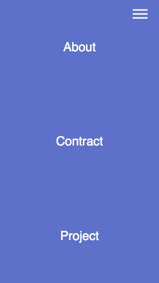

# Animated Bubble Menu

This tutorial comes curtesy of a Youtuber by the name of 'Dev Ed'.

[You can check out his YouTube tutorial here!](https://www.youtube.com/watch?v=H4MkGzoACpQ)

Menu Closed
;

Menu Opened
;

## To Run

Just open the index.html file in the folder. That's it! To see the animation at work, click on the "hamburger button" (that's the icon in the top right corner with the three lines). This will open the menu and make the menu icons appear. Click the hamburger button again to close it.

## My Thoughts

This really simple tutorial was actually really helpful for me as it introduced a few CSS concepts I'd never engaged with before. Specifically, the "clip-path" property which can be very useful for showing and hiding different on-screen elements at different times.

Aside from the cool menu application (which I will likely use in the future), I've been thinking more and more about trying to make some simple, browser-based games to help get my name out there that I imagine could utilize clip-path in different ways.

I'm also not sure I knew about the pointer-events CSS property which can enable and disable pointer events within an element. Again, I can already imagine a few places where that might come in handy.

It's suprising what new things even a simple tutorial like this can unearth for you.
