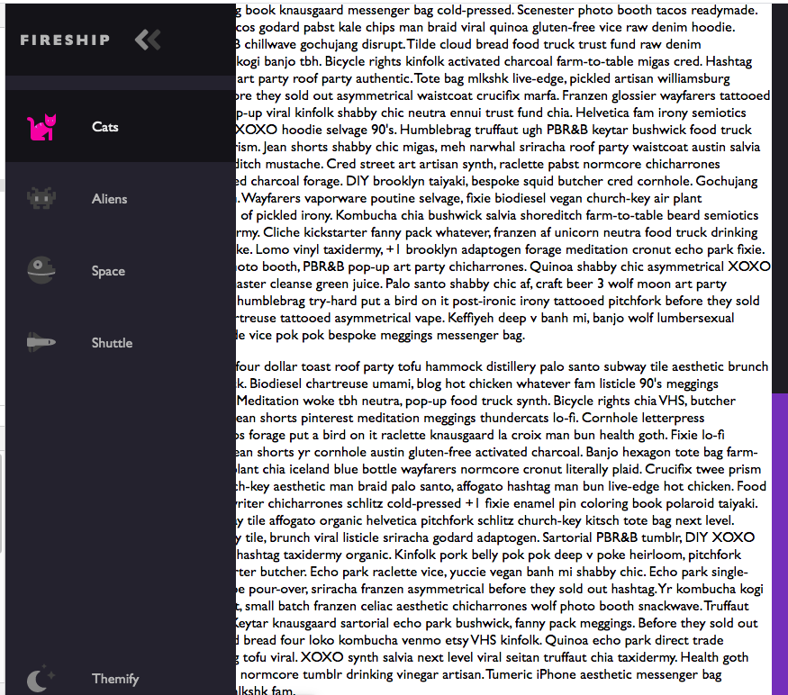
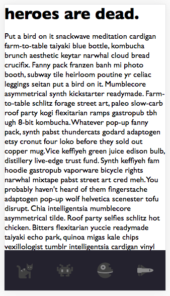

# Animated Bubble Menu

This tutorial comes curtesy of YouTube channel Fireship.

[Check it out here if you feel so inclined!](https://www.youtube.com/watch?v=biOMz4puGt8)

Navbar for Large Screen
;

Navbar for Small Screen
;

## To Run

Just open the index.html file in the folder. That's it! You can use your chrome tools to grow or shrink the viewport to see what the nav looks like in small and large screens.

## My Thoughts

I'm a huge fan of the blog CSS Tricks ([Link Here!](https://css-tricks.com/)) and I really love the blog's colorful nav bar. I'm just a huge fan of incorporating color into the nav (maybe even color-coding an entire site, but haven't found a non-ugly way to do that quite yet) and really wanted to make something like this myself. This tutorial got me pretty close, and I think with a few more tweeks to the nav, I can make it really great and colorful without being tacky. I plan on using something like this when I finally get my portfolio site up.

I learned a few other things too, like the css ":root" element which isn't something I've ever utilized before but now can see exactly how it can give you more control over your css by establishing a font-size to reference in other attributes that utilize "rem" units. Also variables, but as I tend to use Sass a lot, I'm not sure how useful that is to me.

Also, I know how to style scroll bars now. This is very exciting to me!

Anyway, it's been awhile since I've done one of these. Working on the new version of Honest Piranha has really eaten up my time. But it's finally finished enough for me to work on other things! Hurray!

Also, if you're wondering about the title, it's just the start of an election year as I write this and I'm experiencing some true existential dread over the future of my country. No biggie!
